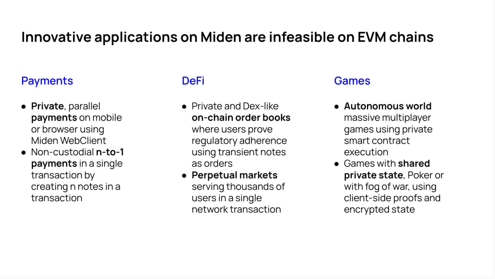

# Novel Applications

Leveraging Miden's novel architecture opens the door to a plethora of innovative applications that were previously impossible on Ethereum or other EVM-based blockchains. In this discussion, we aim to list different proofs of concept (PoC's) for such applications.

### Payment

- [Private payment](./private_payment.md)
- [n-1 payment]()

### Defi

- [Private on-chain order book](https://github.com/0xPolygonMiden/examples/discussions/138)
- [Perpetual market]()

### Gaming

- [Autonomous world]()
- [Shared private state games]()

### Identity

- [Identity proofs]()
- [ZK KYC]()

### Compliance

- [Private provable compliance]()
