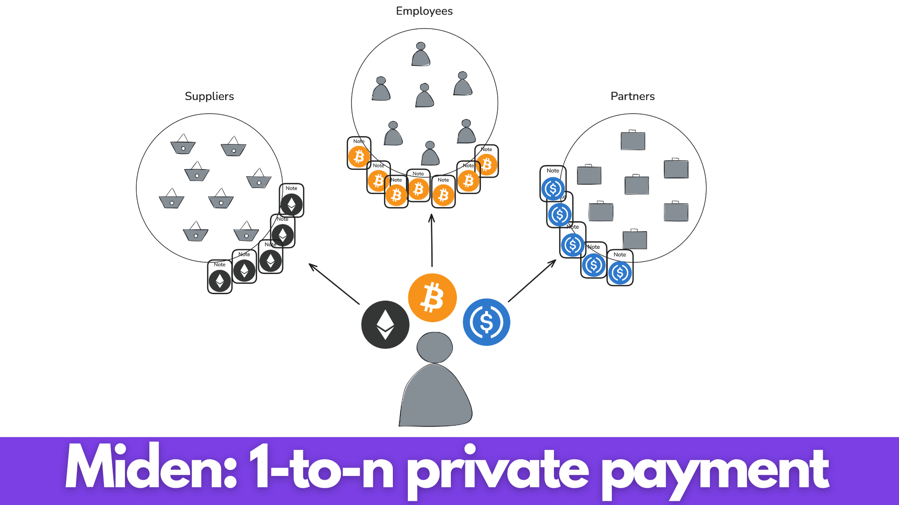

# 1-to-n Private Payment

## What is 1-to-n private payment and why is it powerful?

1-to-n private payment is a powerful primitive enabling:

- Consolidation of multiple payments in **ONE SINGLE TRANSACTION**
- Increased privacy for all involved parties ([learn more.](./private_payment.md) about private payments)
- Reduced processing time
- Reduced complexity of tasks and possibility of errors
- Reduced administrative costs

The use cases for 1-to-n payments are diverse, encompassing a wide range of financial operations. These include user payments, large-scale corporation payrolls, and document, ticket, and NFT issuance, among others.

1-to-n payment would enable actors from individual users to large corporations to benefit from a better payment primitive.

## How Does Miden Enable 1-to-n Payments?

Miden enables the consumption and generation of an arbitrary number of [notes](https://docs.polygon.technology/miden/miden-base/architecture/notes/) (now ~1000 - artificially constrained). Each of these notes can be public or private and be used to transition a user's account from a state `S` to a state `S'`.

We agree on the following initial state:

- There are 11 users, one is Alice
- Alice owns `10 Ether`
- Alice wants to send `1 Ether` to each other user
- Alice wants to remain private

The process works as follows:

1. Alice transitions her state from a state `S` where she has `10 Ether` to a state `S'` where she has `0 Ether` left. Generating 10 different `Notes` with 10 different recipients, being each other user.

2. Alice transfers these `Notes` containing the assets to the other users using a private arbitrary solution (On-chain encrypted notes (on the roadmap), Telegram, Signal, etc.).

3. The other users each receive the `Note` and transition their individual states from `S` where they have `x Ether` to `S'` where they have `x+1 Ether`, consuming the `1 Ether` placed into the `Note` by Alice into their own states.

## An Application Leveraging 1-to-n Payment on Miden

Leveraging the primitives mentioned above, we can imagine a powerful 1-to-n payment app that would enable companies of all sizes to manage their payments in an elegant, private, fast, cheap, streamlined way, built on top of Miden's infrastructure.

Taking inspiration from applications that could leverage 1-to-n payment like [TicketMaster](https://www.ticketmaster.com/) or [Wind](https://wind.app/developer), we can imagine a simple and modern dashboard enabling multiple payments or document issuance at once.

## Conclusion

The introduction of 1-to-n private payments on Miden offers a solution to long-lasting payment challenges faced by corporations and individuals. By providing efficiency, reduced costs, error minimization, privacy, and the ability to consolidate transactions, 1-to-n payments could enhance how individuals and companies manage financial operations.
