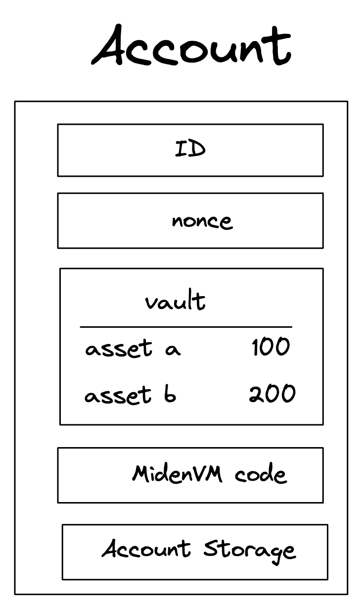

# Private Payment

## The Why?

### Introduction

Efficient payments are a backbone of human societies. They enable exchange of value for goods and services, facilitate social functioning (participating in activities e.g., going to the restaurant), and support economic growth. Without them, commerce would grind to a halt, financial stability would be undermined, and access to essential services would be severely limited, potentially leading to economic stagnation and social disruption.

### Blockchains as a Payments Infrastructure

Since the very first blockchain, Bitcoin, payments have been the flagship use case. With further developments like Ethereum and alternative L1's (Polygon, Tron, Near) and innovations like rollups (Base, Starknet, Scroll), payments have been made faster and cheaper.

| Blockchain | Bitcoin | Ethereum | Polygon | Base |
|------------|---------|----------|---------|------|
| Avg. tx fee ($) | 0.68 | 1.85 | 0.003 | 0.00005 |
| Cost | High | High | Low | Virtually free |
| Speed | Low | Low | High | High |
| UX | Poor | Poor | Poor | Average |
| Network | Decentralized | Decentralized | Less decentralized | Centralized |
| Privacy | None | None | None | None |

Nonetheless, for years blockchain payments have remained expensive and slow, especially at the base layers due to high gas fees and slow finality (~1 hour for Bitcoin and 12 minutes for Ethereum), complex to make due to bad UI/UX, and lack essential functionalities like privacy.

This has prevented blockchains from acquiring the role of leading payment infrastructure and forced users to continue relying on classical centralized infrastructures (e.g., Visa, Mastercard, PayPal, Venmo, Revolut, Banks, etc.).

### The Importance of Privacy in Payments

Privacy in payment systems is crucial for protecting individual freedoms, maintaining financial autonomy, and ensuring the healthy functioning of economies. Different payment infrastructures offer varying levels of privacy:

1. Traditional Banking Systems:
   - Users have privacy from other users
   - No privacy from the bank/operator
   - No privacy from the government

2. Current Decentralized Systems (e.g., public blockchains):
   - No privacy from other users (transactions are visible)
   - No privacy from network operators/validators
   - No privacy from the government
   - Pseudonymity ≠ Privacy (transactions can often be linked to identities)

3. Implications of Limited Privacy:
   - Chilling effect on transactions: Users may avoid certain purchases or donations
   - Financial surveillance: Governments or corporations can track spending habits
   - Discrimination: Transaction history could be used for unfair treatment
   - Security risks: Visible wealth or spending patterns may attract criminals

This lack of privacy hinders the freedom of users, who may refrain from transacting because of the trace they could leave in the system.

Ideal Privacy in Payments:

- Transactional details visible only to involved parties
- Protection against both external observers and system operators
- Ability to selectively disclose information for regulatory compliance

Privacy-preserving payment systems empower users to transact freely without fear of surveillance or judgment, fostering a more open and innovative economy.

### What about current private decentralized systems?

We already have existing decentralized privacy-preserving protocols as of the time of writing, being [Zcash](https://z.cash) and [Monero](https://getmonero.org), hence why would we need other systems?:

1. Lack of stable assets:

    Zcash and Monero respectively and exclusively use the `ZEC` and `XMR` tokens, meaning that widely used stablecoins like `USDC`, `USDT`, and others can't be ported and used on such blockchains. The lack of stable assets pegged to an existing currency hinders the ability of users to pay and get paid for "real world" goods and services, hence preventing those systems from becoming widely adopted payment solutions and replacing current payments infrastructure.

2. Expensive payments:

    The average transaction fee of these blockchains as of the time of writing is:

    - On Zcash: $0.023
    - On Monero: $0.061

    Although being only a few cents, these transaction fees are still too high by orders of magnitude to compete with classical payment systems or existing blockchain rollups, pushing the average user to transact on those systems.

3. Bad user experience

    Most payments for general purpose blockchains must be made through browser wallets or cold wallet interfaces, which do not provide a compelling user interface and experience compared to existing banking apps like Venmo, PayPal, or Revolut. It is nonetheless important to note that attempts have been made, e.g., [Zashi](https://z.cash/ecosystem/zashi-wallet/).

    I believe that Miden can solve these issues. Let me show you how.

## The How?

### Miden: An Improved Payments Infrastructure

Given the limitations of existing blockchains and payments infrastructure, both public and privacy-focused, there is a clear need for a solution that combines privacy, efficiency, and functionality. This is where Miden enters the picture. By building on the foundational work around privacy of projects like Zcash and Monero and around computation of a project like Ethereum, while also incorporating lessons learned from scalable solutions like rollups, Miden presents a promising approach towards building a more ideal payments infrastructure.

The Miden protocol gives us the best of all worlds by addressing each of the key issues identified in current systems:

| Aspect | Current Systems | Miden |
|--------|-----------------|-------|
| Network Structure | Centralized | Decentralized (On the roadmap) |
| Asset Support | Lack of stable assets | Arbitrary assets |
| Programmability | Lack of programmability | Turing Complete VM |
| Privacy | Public | Private |
| Cost | Expensive | Cheap |
| Speed | Slow | Fast |
| User Experience | Poor UX | Abstracted UX (Applications) |

### The Miden Protocol

#### Peer-to-peer private transfers

Miden enables users to perform peer-to-peer private transfers using local execution and local proving. Here is an example of it step by step:

We agree on the following initial state:

- There are 2 users, Alice and Bob
- Alice owns 1 Ether, Bob owns no assets
- Alice wants to send her 1 Ether to Bob
- Alice and Bob want to remain private

To do so, the following scheme can be applied:

1. Alice transitions her state from a state `S` where she has `1 Ether` to a state `S'` where she has `0 Ether`, transferring the asset into a `Note` using the [P2ID script](https://github.com/0xPolygonMiden/miden-base/blob/main/miden-lib/asm/note_scripts/P2ID.masm).

2. Alice transfers this `Note` containing the asset to Bob using arbitrary solutions (On-chain encrypted notes (on the roadmap), Telegram, Signal, etc.).

3. Bob receives the `Note` and transitions his state from `S` where he has `0 Ether` to a state `S'` where he has `1 Ether`, consuming the `1 Ether` placed into the `Note` by Alice into his state.

#### Account abstraction

Ethereum has set the standard for accounts in the VM-enabled blockchain world. There are two types of accounts in Ethereum:

- Externally owned accounts (EOA): are created by generating a public/private ECDSA key pair. Does not hold code. Can initiate transactions.
- Contract accounts (Smart contracts): are created by being deployed on the Ethereum blockchain by an EOA. Holds code which can be executed. Can't initiate transactions.

We clearly understand here that Ethereum has made the choice to separate user accounts from executable code. What if we could merge both to enable programmable user accounts? Welcoming `Account abstraction`, which can be defined as follows:

"Account abstraction is a method of setting up a blockchain network in which users' assets are stored exclusively in smart contracts, and not in external accounts (External Owned Accounts, EOAs). When using this approach, a crypto wallet turns into a unique smart contract that can be programmed for various purposes."

[What is account abstraction and why is it important - Medium - Aleksander](https://medium.com/@alex-100/what-is-account-abstraction-and-why-is-it-important-9627a4ced4f3)

Miden supports full account abstraction, enabling full programmability of user accounts defined as follows:

    

The `Miden VM code` field hints that all Miden accounts are `abstracted`, which enables arbitrary logic to be executed against them, opening the door to unbounded functionalities. Using these innovations, we can imagine improvements in UX like social recovery, abstracted seed phrases, Face-ID signing, and many more.

#### Privacy scales better

At Miden, we believe that [privacy scales better](https://polygon.technology/blog/privacy-a-fundamental-right-and-a-practical-necessity)! Using local execution and local proving, the computation is pushed to the edges of the system. Users would execute and prove their own state transitions directly on-device, which means that the node operators do not need to handle and charge for complex computation, hence making the blockchain faster and cheaper for users. This scheme firstly ensures privacy because no private data leaves the user's device and secondly makes the use of the blockchain cheaper for the user.

#### Finally

In this section, we covered privacy through [peer-to-peer private transfers](#peer-to-peer-private-transfers), improvements in UX through [account abstraction](#account-abstraction), and lastly, fast and cheap transactions through [privacy enabling better scaling](#privacy-scales-better).

## The vision

### A powerful payment application on Miden

Leveraging the Miden primitives mentioned above, we can imagine a powerful payment application that would combine privacy, fast and cheap payments, a stunning user interface, great user experience while being built on top of a fully permissionless and decentralized infrastructure, Miden.

The following features would be required:

- A modern, simple and clean frontend
- Ability to make transfers in a fast, cheap and privacy preserving way
- Ability to create accounts with a simple onboarding flow (abstracted seed phrases)
- Built on top of Miden

#### The frontend

Taking inspiration from successful current payments apps, we would prioritize simplicity and cleanliness for the interface, making the application approachable for users with any technical level.

**Venmo:**

**Revolut:**

We can imagine a frontend that would aggregate all user assets and transfers, display a portfolio value and enable transfers:

    

#### The backend

##### Making private transfers

*Question: How can the application developer use Miden to make private transfers?*

Using the [Miden SDK](https://www.npmjs.com/package/@demox-labs/miden-sdk?activeTab=readme) or the [Miden client](https://github.com/0xPolygonMiden/miden-client), an application developer can import Miden core components into their application, enabling them to create accounts, use the [Miden VM](https://github.com/0xPolygonMiden/miden-vm) to make state transitions (transactions) and generate notes, [Miden prover](https://github.com/facebook/winterfell) to make proofs and preserve privacy, and more.

##### Account storage

*Question: Where and how would I store my account?*

The user account, assets and private key would be stored securely on device. For additional redundancy, we could add social recovery solutions, storage of an encrypted account state in the cloud, and more.

##### Secure enclave and Keystore

*Question: I don't really know what a private key is and it seems too important for me to store it safely, how can I do it?*

To make the user onboarding seamless, we would want to abstract away seed phrases and complex blockchain security measures. We could achieve this using the secure element of modern phones which stores key-pairs in trusted execution environments (TEEs) enabling signatures. They are currently used for face or finger recognition, login, WebAuthn, payment and more:

- [Secure enclave](https://support.apple.com/en-gb/guide/security/sec59b0b31ff/web) for Apple phones
- [Keystore](https://developer.android.com/privacy-and-security/keystore) for Android phones

To leverage these secure elements in Miden, we would need to implement signature verification for their supported signature schemes. A signature scheme supported by both of these secure elements is [ECDSA](https://en.wikipedia.org/wiki/Elliptic_Curve_Digital_Signature_Algorithm). [ECDSA signature verification](https://github.com/0xPolygonMiden/miden-vm/blob/4923e3d69622e6b8a5d91fab2949cb83845cf134/stdlib/tests/crypto/ecdsa_secp256k1.rs) support on Miden would enable users to sign Miden transactions using their phones' face / finger recognition, password, etc., making the onboarding flow simpler.

##### The relayer

*Question: Considering that the transactions are made locally by the users, how would notes be handled and delivered to the recipients?*

Relaying could be handled in different ways:

- Off-chain relaying: the application or external actors could provide relaying services for the notes of the users (losing privacy against the relayer)
- On-chain relaying: the users could use on-chain encrypted notes to interact with other users (on the roadmap)

The first method could be assimilated with a `PUSH` scheme where the source would send their notes to the relayer and the relayer would send those notes to the intended target. The second method could be assimilated as a `PULL` scheme where the source would encrypt notes and send them to the Miden rollup. The application would then need to filter existing notes from the rollup notes tree and consume relevant notes for the target user (which could be done on action or time basis).

##### Miden name service

*Question: How would I easily find and interact with my contacts if addresses are a bunch of random characters starting with `0x`?*

To simplify the addition and management of contacts and make the experience more recognizable by web2 users, we could improve the address book of the application by leveraging [Miden name service](../identity/miden_name_service.md). A name service is essential for users to easily find, send and remember contacts (We do not store phone numbers as numbers in our phones, we store them as names, attached is the phone number e.g. Mom -> +123456789).

##### Users need to sign a transaction for each action

*Question: Wouldn't I have a bad experience needing to sign each and every action I make inside the application?*

Most web3 apps forced their users to sign a transaction for each of their actions because each state update of a blockchain requires a valid account signature. We can solve this using these two solutions:

- Batching of user actions: User actions can be batched and do not need to be sent on each action.
- Hybrid web2 / web3 apps: Not everything needs to live on-chain, the application developer can handle some of the actions on a classic web2 backend, while the users keep sovereignty over their assets and data in a web3 way.

##### What about fees?

*Question: Wouldn't I need to pay a lot in fees for each transaction?*

Any digital system incurs costs, be it centralized or decentralized. The cost of the material, running the software, employees, offices, etc. The default behavior for web2 applications is to subsidize these costs for their users, making the use of the service free and finding other ways to make profit. Current blockchains (web3) impose gas fees on their users relative to their computational use of the system. This payment of fees on each action has made the user experience and the cost to use blockchain systems higher than their web2 counterparts, hindering the adoption of blockchain-based applications.

Miden's account abstraction solves this by enabling application developers to subsidize gas costs for their users through a [paymaster](https://www.stackup.sh/blog/what-are-paymasters) scheme. Furthermore, the cost incurred by fees on Miden would be small; thanks to [private scaling](#privacy-scales-better).

#### Additional features

We could imagine additional features which could be added to this type of application:

- Simple DeFi page, aggregating best sources of yield / lending / borrowing from different Miden protocols
- Creation of digital bank cards and integration with Apple / Google Pay
- Creation of physical bank cards (Gnosis card, Crypto.com card, etc.)

### Conclusion

Miden represents a significant leap forward in blockchain-based payment systems, addressing key limitations of existing solutions. By combining privacy, programmability, and scalability, it opens the door to user-friendly applications that could revolutionize how we transact, as presented above.
